# Cloud9

[Cloud9](https://aws.amazon.com/cloud9/) is an integrated development environment that runs on a virtual machine. It includes a text editor, file manager, and Linux terminal that you can access directly from the browser.

To access the development environment you will need an account on Amazon Web Services \(AWS\). You can create the account [here](https://aws.amazon.com/cloud9/).

The free tier has all the resources needed for the activities proposed in the labs. Before using a resource make sure is included in the package so it won't generate extra costs. Details are availabel [here](https://aws.amazon.com/free/).

## Configure a Cloud9 environment

The detailed documentation is available at the following address [https://docs.aws.amazon.com/cloud9/latest/user-guide/welcome.html](https://docs.aws.amazon.com/cloud9/latest/user-guide/welcome.html)

Follow this instructions to create a new environment

1. Navigate in the Cloud9 console

[https://console.aws.amazon.com/cloud9/](https://console.aws.amazon.com/cloud9/)

1. Press "Create environment"

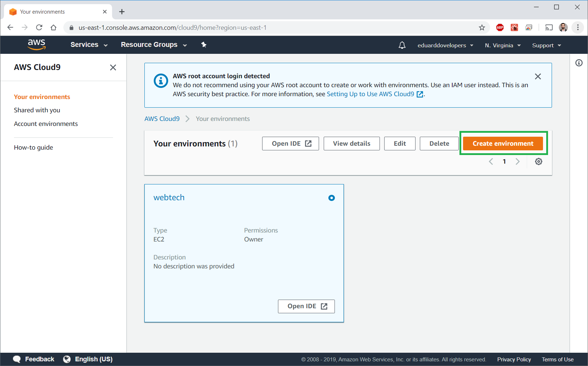

1. Step 1 - Provide a name

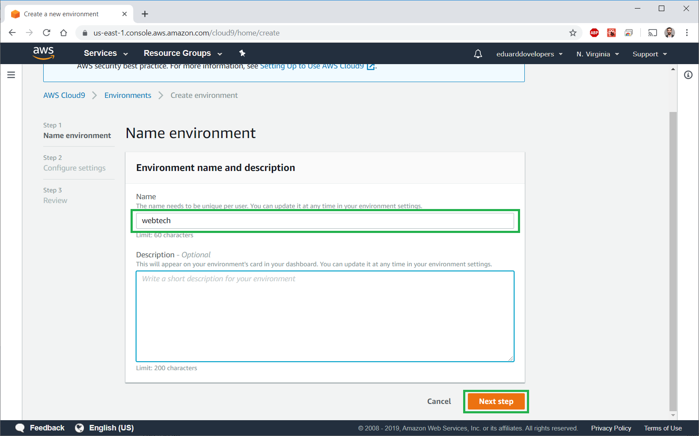

1. Step 2 - Configure the desired settings 

**Important!** Choose a _**t1.micro**_ instance type to stay in the free tier. Choose _**Ubuntu Server 18.04**_.

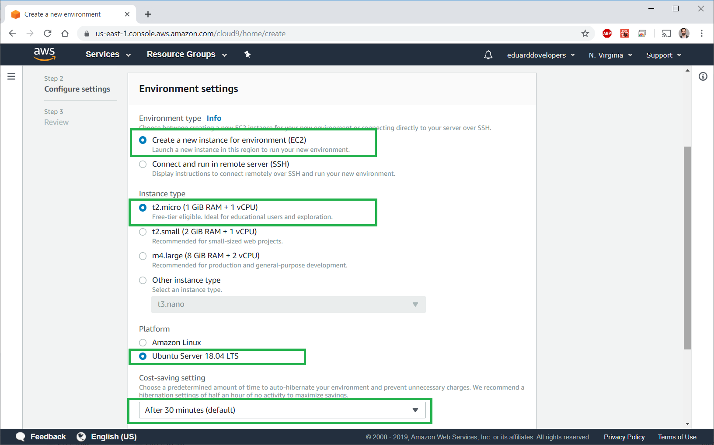

1. Step 3 - Confirm the settings and press "Create environment"

You will get redirected to a new page. In a few minutes the setup will be finished.

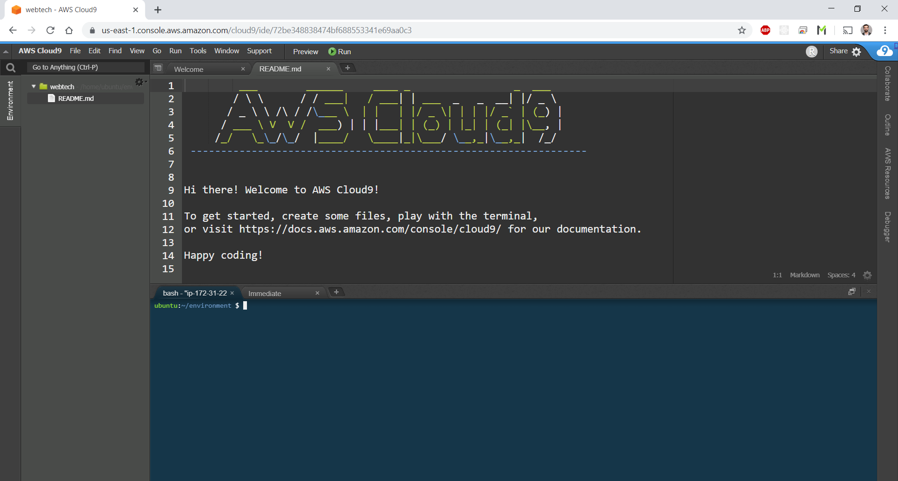

## Getting familiar with the development environment

A complete tour is available at the following address [https://docs.aws.amazon.com/cloud9/latest/user-guide/tour-ide.html](https://docs.aws.amazon.com/cloud9/latest/user-guide/tour-ide.html)

The most used functions are:

1. The file manager
2. The bash terminal
3. The text editor

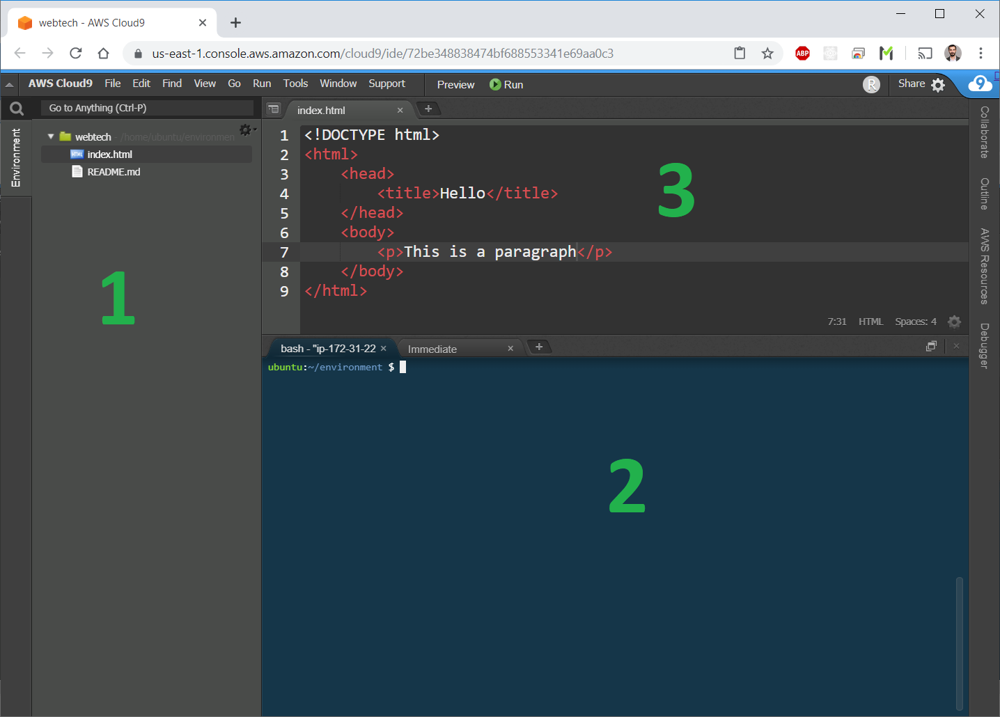

**The file manager** is located on the left side. Here you will find all the files and directories form `/home/ubuntu/environment`.

**The bash terminal** is located on the right side bottom.

Test it with some linux commands

List the contents of the current directory:

```bash
ls
```

Show the path to the current directory:

```bash
pwd
```

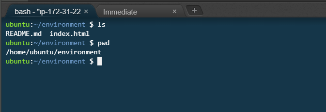

The text editor is located in the upper right space

## Firewall settings

Next we need to configure firewall settings so that we can allow access to the ports that will be used frequently.

1. Navigate in the AWS console - [https://console.aws.amazon.com/ec2/](https://console.aws.amazon.com/ec2/)

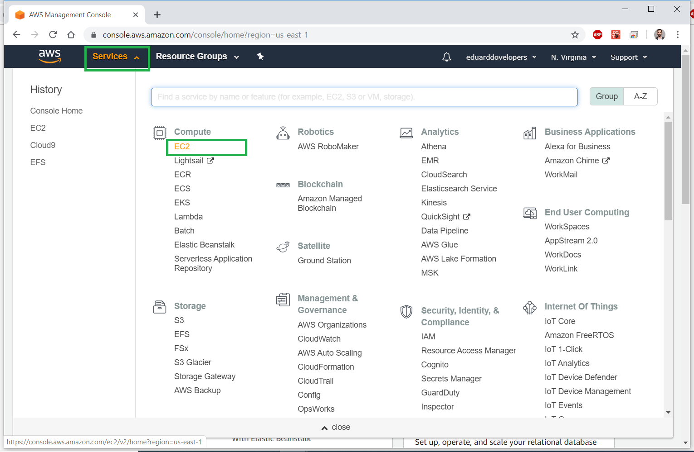

1. List EC2 instances

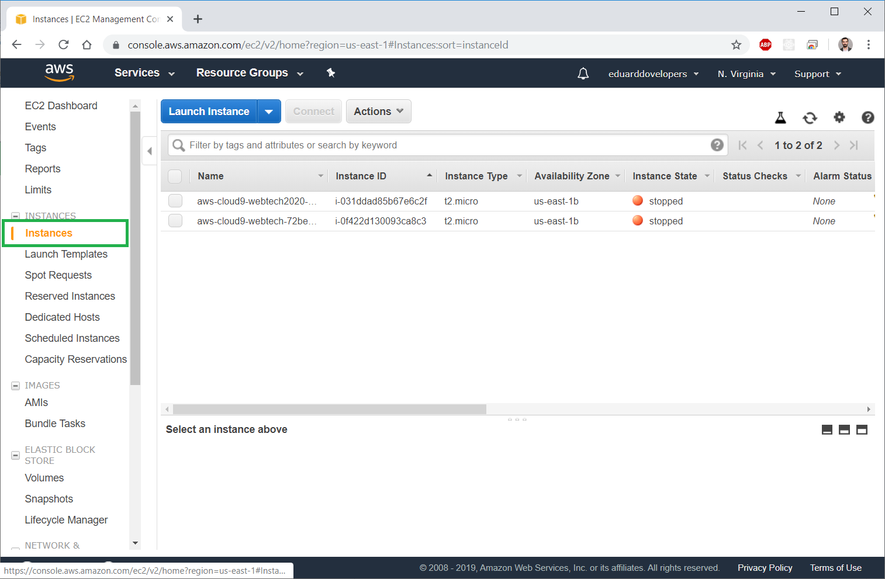

1. Find the Security Groups column and click on it

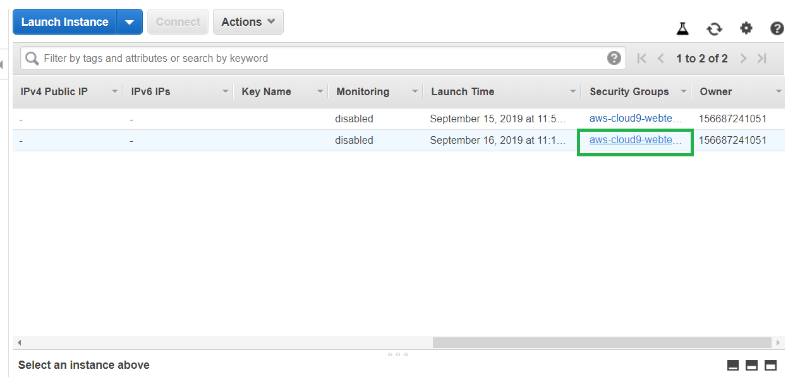

1. Navigate in the Inbound tab and press edit Edit

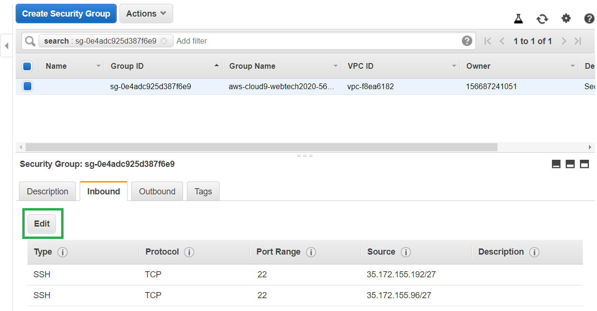

1. Add ports `8080, 3000, 3001`

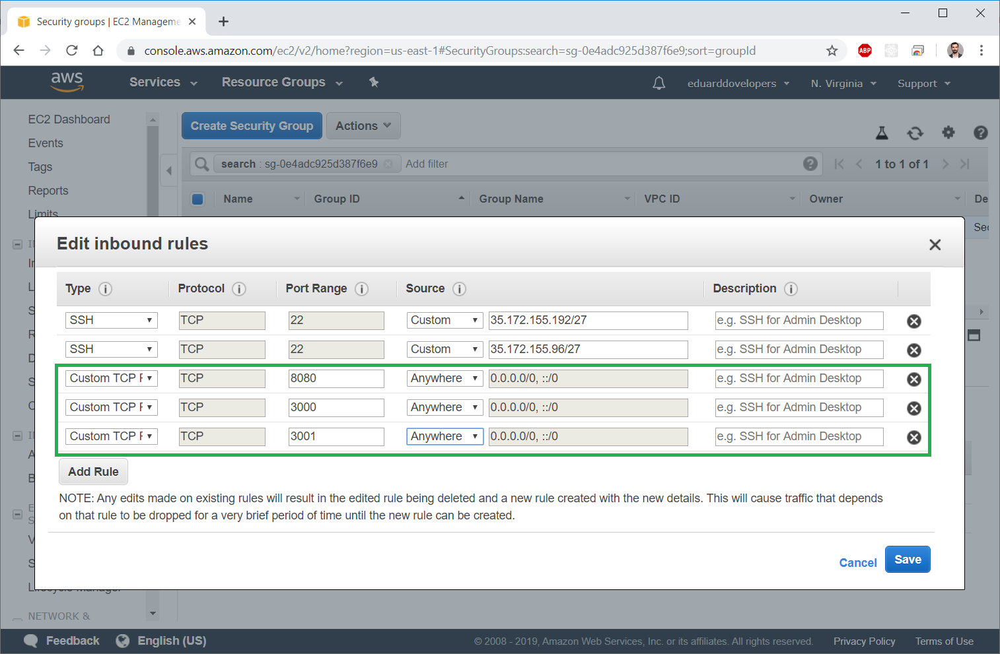

1. Press Save

