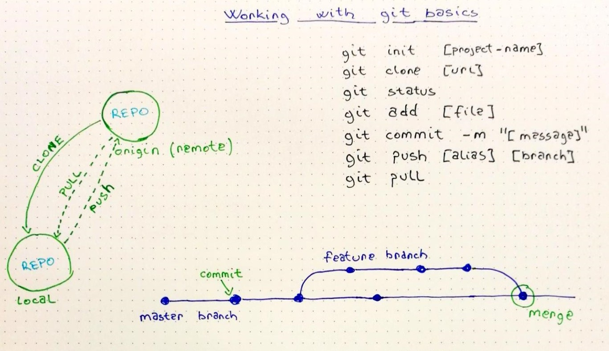

# Working with GIT

Join GitHub \([https://github.com/join](https://github.com/join)\).



```bash
git init
git clone [url]
git status
git add [file]
git commit -m "a descriptive commit message"
git push [alias] [branch]
git pull
```

## Resources

* [pdf cheat sheet](https://github.github.com/training-kit/downloads/github-git-cheat-sheet.pdf)
* [ghid instalare și comenzi de bază](https://rogerdudler.github.io/git-guide/)

