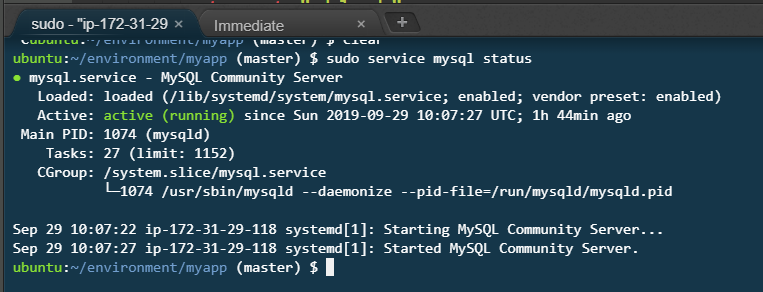
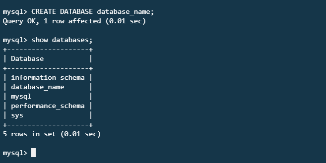

# MySQL \(cloud\)

We are using `mysql` as a persistence layer for our application. In short this is where the data is store.

Make sure that the service is up and running by typing this command in the console:

```bash
sudo service mysql status
```



## Configuring a new user

Connect to the database service using the `root` user and add new credentials for the application

```bash
sudo mysql -u root
```

In the example below replace `username` and `password` with the desired credentials. Make sure you will remember them.

```bash
CREATE USER 'username'@'localhost' IDENTIFIED BY 'password';
```

Then grant the required privileges to access all the databases.

```bash
GRANT ALL PRIVILEGES ON *.* TO 'username'@'localhost' WITH GRANT OPTION;
```

In order to exit the mysql console type `exit` and press enter.

## Connecting to the mysql server 

Run the following command with the newly created credentials.

```bash
mysql -u username -p
```

You will be prompted to type the password, but no characters will be displayed. Press enter to connect

## Creating a new database

```text
CREATE DATABASE database_name;
```

To list all the databases type the following command:

```text
SHOW DATABASES;
```



## Getting back to the linux console

Type `exit`

