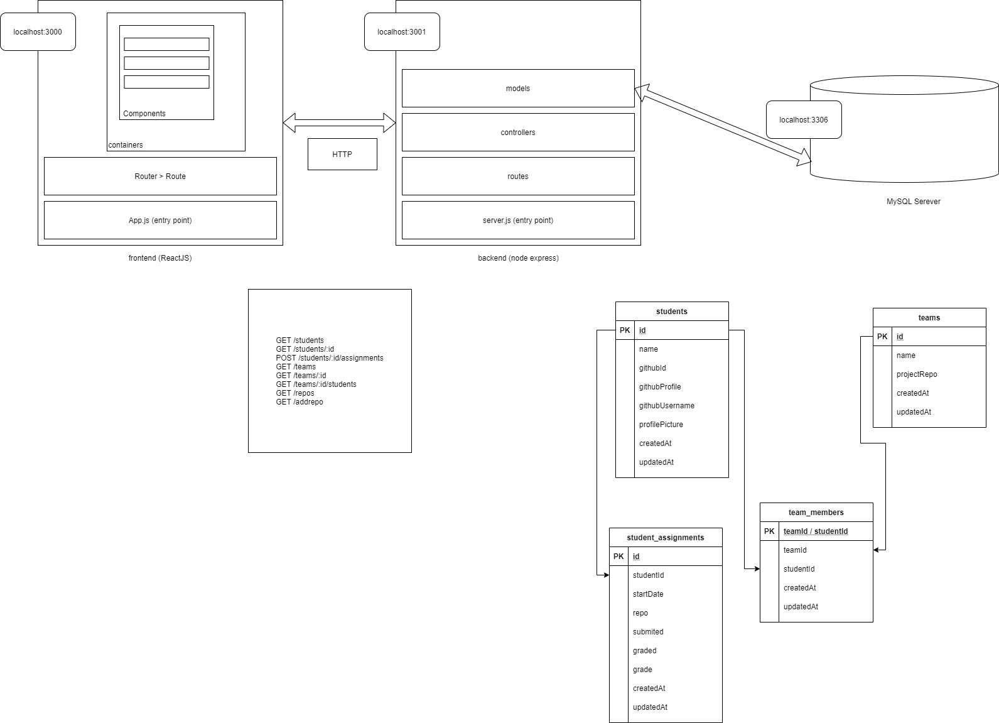

# Application architecture

The frontend component is the application interface and is developed using ReactJS. 

The backend component allows access to data via a RESTful API and is developed in ExpressJS and Sequelize. 

The data persistence component is provided by the MySQL server which allows the management of relational databases. 

The figure below shows the links between the three components, the communication protocol and the data flow.

