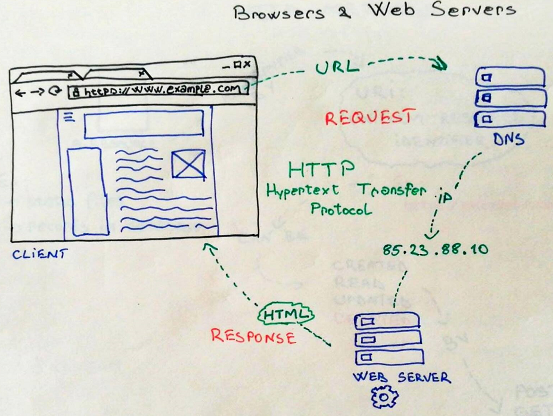
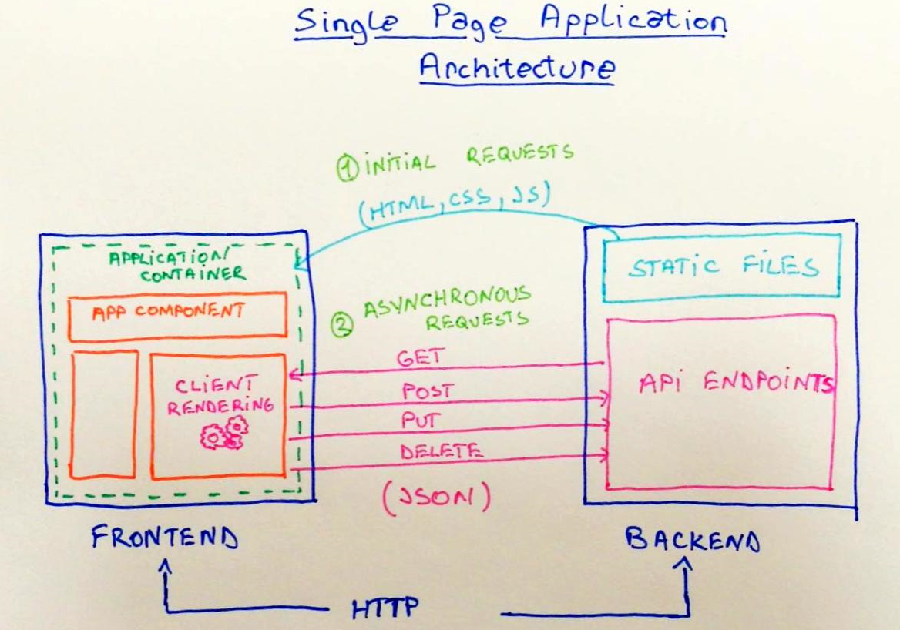

# Application architecture

We will follow a very popular pattern called Single Page Application for the apps that we are building.

Before jumping to coding let's take a few moments to reflect on how users are interacting with web pages and what is the data flow from a technical perspective.

First of all, when a user opens a web page by typing an URL address, the browser will translate the text into an IP address by addressing a DNS service. Then it will launch a HTTP request to the web server to extract the desired resource.

The web server will handle the request and will return a response in a text based format. This could be in HTML, JSON or XML format depending on the implementation. In the cases of HTML the browser will parse the response and render it in a visual representation.

In a Single Page Application the initial request will return what we call an app shell. The rest of the data will be retrieved by subsequent HTTP requests using GET, POST, PUT or DELETE methods .

We call this an asynchronous communication model that is triggered by each action performed by the user within the web page.

For the purpose of demonstrating this architecture, we will imagine a simple app that allows one to send messages like in a guest book.

The application will implement all the CRUD \(create, read, update, delete\) operations on data stored in the database. Next we will deal with the backend implementation aka the API.

