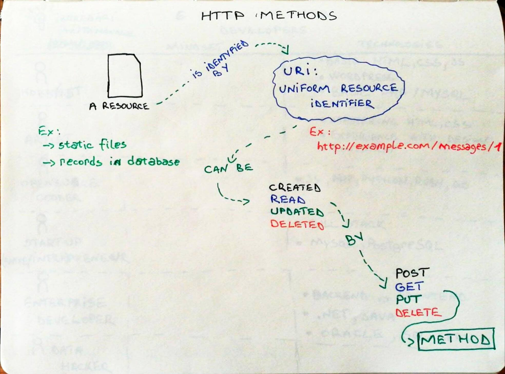
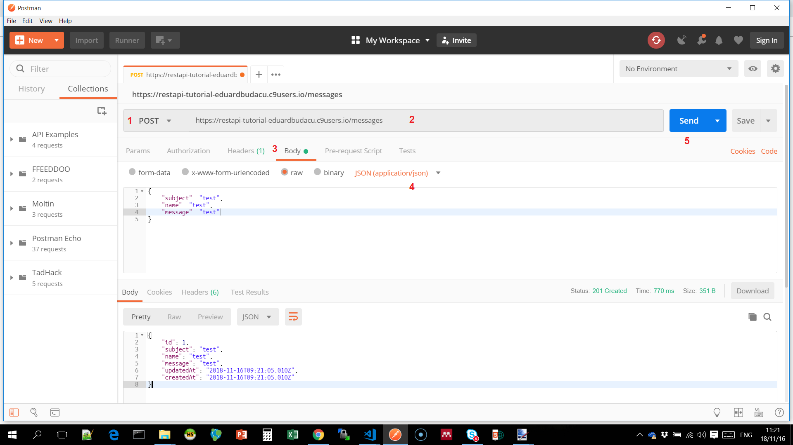
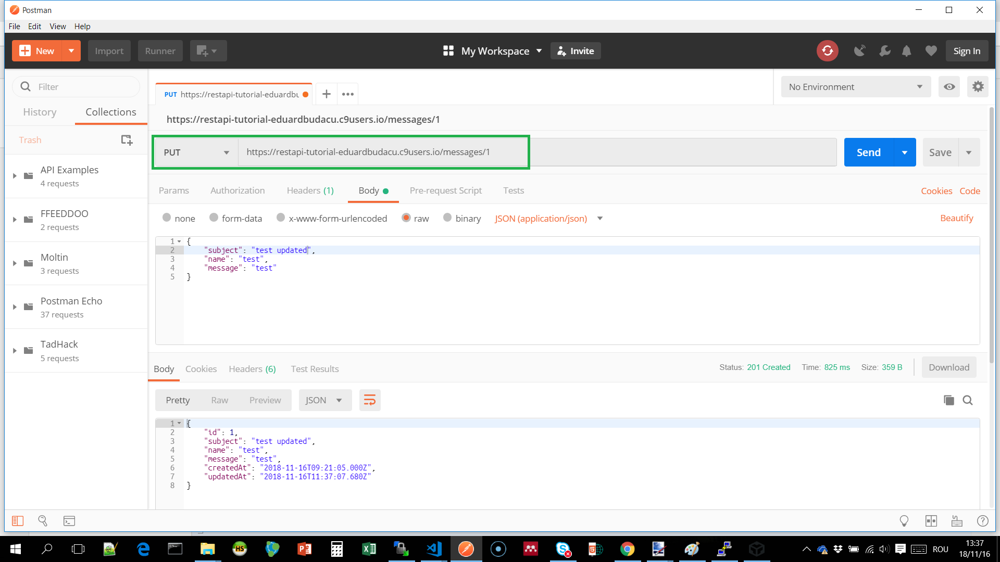

# RESTful API

A RESTful API is a method to expose data and perform CRUD operations on top of the HTTP protocol.

In this exercice we will be creating a web server using NodeJS and the ExpressJS framework. Data will be stored in MySQL and we will be using Sequelize to model the tables and relations.

## 1. How to initialize a NodeJS app?

In order to initialize a node app open a directory where you want to create the app and  execute the following command in the terminal

```bash
npm init
```

You will be prompted to fill in the following details:

* Name
* Version
* Description
* Entry point
* Test command
* Git repository
* Keywords
* Author
* License

Before completing this step you need to confirm the data is correct:

If everything went well a _**pagckage.json**_ file is generated

* [ ] TODO: check if the package.json exists
* [ ] TODO: create a new file called _**server.js**_

## 2. How to build a HTTP server using ExpressJS?

ExpressJS is a lightweight, but powerful framework for building web applications or web services.

To include this dependency in your project run the following npm command

```bash
npm install express --save
```

Write the code in the _**server.js**_ file

```javascript
const express = require('express')
```

Next create a constant called`app`

```javascript
const app = express()
```

Use the static files middleware to serve your webpage assets `express.static`

```javascript
app.use('/', express.static('frontend'))
```

The first parameter is the path where you want the files to be served. The second parameter is the middleware configured with the directory where the files are located.

Configure the server to listen to 8080 port for HTTP.

```javascript
app.listen(8080)
```

* [ ] TODO: crează un director denumit `frontend`
* [ ] TODO: adaugă în directorul creat un fișier `index.html`
* [ ] TODO: deschide în browser aplicația accesând adresa URL \([http://ip:8080](http://ip:8080)\)

## 3. Cum instalez MySQL și cum creez baza de date?

If you havent done this allready, follow the tutorial published [here](../development-environment/mysql.md).

Login into the console and create a database called **profile**:

```sql
create database profile;
```

* [ ] TODO: check if the database was created by executing `show databases;`
* [ ] TODO: exit the mysql console by typing `exit` and pressing enter

## 4. Cum mă conectez la baza de date din NodeJS folosind Sequelize?

Sequelize este o bibliotecă orientată obiect de tip ORM \(object-relational mapping\). Permite realizarea unei reperezentări a tabelelor din baza de date prin modele și relații între modele. Un model este un obiect ce permite operațiile standard pe baza de date \(Create, Read, Update, Delete\). Documentația oficială este accesibilă aici: [http://docs.sequelizejs.com/](http://docs.sequelizejs.com/)

Pentru a folosi Sequelize în proiect sunt necesare pachetele **sequelize** și **mysql2** pe care le vom instala prin `npm`

```bash
npm install --save sequelize
```

```bash
npm install --save mysql2
```

Următorul pas presupune includerea pachetului în fișierul server.js și instanțierea unui obiect `sequelize`

```javascript
const Sequelize = require('sequelize')

const sequelize = new Sequelize('profile', 'root', '', {
    dialect: "mysql",
    host: "localhost"
})
```

Fac distincție între obiectul `sequelize` și clasa `Sequelize` scrisă cu literă mare. În contstructorul clasei primul parametru este numele bazei de date, al doilea prametru este utilizatorul și al treilea este parola. Ultimul parametru este un obiect ce descrie date despre tipul de bază de date folosit și adresa serverului.

Pentru a realiza conexiunea la baza de date utilizez metoda **authenticate\(\)**

Metoda returnează un obiect de tip `Promise` pentru care trebuie să specific funcțiile pe care să le apeleze atunct când conexiunea se realizează cu succes, respectiv întâmpin o eroare.

```javascript
sequelize.authenticate().then(() => {
    console.log("Connected to database")
}).catch(() => {
    console.log("Unable to connect to database")
})
```

* [ ] TODO: testează conexiunea rulând `server.js`
* [ ] TODO: verifică în conoslă dacă apare mesajul **Conected to database**

## 5. Cum definesc modele pentru tabele folosind Sequelize?

Un model este o reprezentare a unui tabel în codul sursă al aplicației. Sequelize permite definirea de modele folosind funcția _**define\(\)**_

Primul parametrul al funcției este numele tabelului. O convenție presupusă de lucru cu Sequelize este că numele tabelului va fi definit în limba engleză la plural. Al doilea parametru este un obiect care descrie structura tabelului prin perechi cheie:valoare, unde cheia este numele coloanei și valoarea este tipul de date.

```javascript
const Messages = sequelize.define('messages', {
    subject: Sequelize.STRING,
    name: Sequelize.STRING,
    message: Sequelize.TEXT
})
```

Mai multe detalii despre definirea de modele - [http://docs.sequelizejs.com/manual/tutorial/models-definition.html](http://docs.sequelizejs.com/manual/tutorial/models-definition.html)

Lista cu tipurile de date suportate de Sequelize - [http://docs.sequelizejs.com/manual/tutorial/models-definition.html\#data-types](http://docs.sequelizejs.com/manual/tutorial/models-definition.html#data-types)

Pentru a modela o aplicație este necesar să pornești de la domeniul pe care îl adresează, să identifici entități și relații între entități, să stabilești care sunt proprietățile lor și să identifici tipurile de date corespunzătoare. Este o activitate ce se desfășoară de obicei iterativ și incremenental pe parcursul dezvoltării aplicației. Așa că Sequelize propune un mecanism automat de sincronizare a bazei de date care este descris în pasul următor.

## 6. Cum creez tabelele în baza de date folosind mecanismul de sincronizare din Sequelize?

Sequelize permite sincronizarea automată a modelelor cu baza de date prin intermediul funcției _**sync\(\)**_

Adădugând parametrul `{force: true}` tabelele existente vor fi șterse și vor fi create confrom definiției din model.

Pentru a defini tabelel în baza de date expun enpoint-ul GET /createdb

```javascript
app.get('/createdb', (request, response) => {
    sequelize.sync({force:true}).then(() => {
        response.status(200).send('tables created')
    }).catch((err) => {
        console.log(err)
        response.status(200).send('could not create tables')
    })
})
```

* [ ] TODO: accesează din browser endpoint-ul /createdb
* [ ] TODO: testează dacă tabelul a fost creat executând în consola mysql comenzile `use profile` pentru a selecta baza de date și `show tables;` pentru a afișa lista de tabele din baza de date

## Metode HTTP

În continuare vom dezvolta metode HTTP pentru fiecare operație Create, Read, Update, Delete



## 7. Cum creez o nouă înregistrare într-un tabel folosind metoda POST?

Pentru a permite crearea de înregistrări expun o metodă de tip POST.

Fiecare endpoint din API-ul REST este definită de metoda HTTP și numele resursei la care se referă.

```text
POST /messages
```

Clientul va trimite datele prin cererea HTTP în format `json` sau `urlencoded`. Pentru a interpreta aceste date voi adăuga două bodyParser. Apoi definesc endpoint-ul apelând functia `app.post`.

```javascript
app.use(express.json())
app.use(express.urlencoded())

//definire endpoint POST /messages
app.post('/messages', (request, response) => {
    Messages.create(request.body).then((result) => {
        response.status(201).json(result)
    }).catch((err) => {
        response.status(500).send("resource not created")
    })
})
```

Conținutul trimis în body va fi accesibil pe proprietatea `request.body` ce va fi pasat ca parametru pentru modelul Sequelize în metoda create\(\).

Metoda **create** Sequelize va genera automat instrucțiunea ``INSERT INTO messages (`subject`, `name`, `message`) VALUES ('test','test','test')``.

Dacă comanda va fi executată cu succes rezultatul va fi returnat prin functia callback definită pe metoda `then(callback)`

Dacă aplicația va întâmpina o eroare la scriere în baza de date va apela functia callback definită pe metoda `catch(callback)`

Pentru a testa enpoint-ul creat folosim Postman.



1. Selectează metoda POST
2. Adaugă adresa URL a resursei
3. În tabul body alege optiunea raw și adaugă un obiect json care descrie resursa creată
4. Selectează tipul de continut application/json
5. Trimite cererea HTTP apăsând butonul Send

## 8. Cum expun datele dintr-un tabel folosind metoda GET?

Pentru a lista datele dintr-un tabel vom expune două enpoint-uri. Primul care returnează toată lista de mesaje și al doilea care returnează un mesaj după un ID specific.

```text
GET /messages
```

```text
GET /messages/1
```

Pentru interogarea tabelului modelul sequelize expune metode precum `findAll`, `findByPk`, `findOne`. Functia va returna un obiect de tip `Promise` ce va fi executat imediat ce datele sunt primite de la serverul de baze de date. Mai multe detalii despre interogari aici: [http://docs.sequelizejs.com/manual/tutorial/querying.html](http://docs.sequelizejs.com/manual/tutorial/querying.html)

```javascript
app.get('/messages', (request, response) => {
    Messages.findAll().then((results) => {
        response.status(200).json(results)
    })
})

app.get('/messages/:id', (request, response) => {
    Messages.findByPk(request.params.id).then((result) => {
        if(result) {
            response.status(200).json(result)
        } else {
            response.status(404).send('resource not found')
        }
    }).catch((err) => {
        console.log(err)
        response.status(500).send('database error')
    })
})
```

* [ ] TODO: testează endpoint-urile create folosind Postman

## 9. Cum actualizez o înregistrare folosind metoda PUT?

Actualizarea unei resurse se realizează prin intermediul metodei PUT

```text
PUT /messages/1
```

În primul pas se interoghează baza de date. Dacă resursa nu există serverul va returna statusul 404 și mesajul „not found„.

Dacă resursa a fost găsită o actualizez apelând metoda `update()` cu obiectul trimis în body-ul cererii HTTP.

```javascript
app.put('/messages/:id', (request, response) => {
    Messages.findByPk(request.params.id).then((message) => {
        if(message) {
            message.update(request.body).then((result) => {
                response.status(201).json(result)
            }).catch((err) => {
                console.log(err)
                response.status(500).send('database error')
            })
        } else {
            response.status(404).send('resource not found')
        }
    }).catch((err) => {
        console.log(err)
        response.status(500).send('database error')
    })
})
```

Pașii pentru a testa metoda PUT sunt aceiași ca pentru metoda POST.



## 10. Cum șterg o înregistrare folosind metoda DELETE?

Ultima metodă permite ștergerea unei resurse

```text
DELETE /messages/1
```

Dacă resursa este găsită după ID, apelez metoda `destroy`,iar sequelize va transmite către baza de date instructiunea sql ``DELETE FROM `messages` WHERE id = 1`` și va returna un obiect de tip `Promise`. În final serverul web va raspunde cu statusul **204 NO CONTENT** semnalând că cererea a fost îndeplinită cu succes.

```javascript
app.delete('/messages/:id', (request, response) => {
    Messages.findByPk(request.params.id).then((message) => {
        if(message) {
            message.destroy().then((result) => {
                response.status(204).send()
            }).catch((err) => {
                console.log(err)
                response.status(500).send('database error')
            })
        } else {
            response.status(404).send('resource not found')
        }
    }).catch((err) => {
        console.log(err)
        response.status(500).send('database error')
    })
})
```

* [ ] TODO: testează enpoint-ul în Postman folosind metoda DELETE

## Next steps...

Dacă ai reușit să parcurgi tutorialul până aici, în primul rând felicitări pentru efort!

Iată câteva resurse care te vor ajuta să aprofundezi dezvoltarea de servicii web REST:

* [https://www.restapitutorial.com/](https://www.restapitutorial.com/)
* [https://medium.com/pixelpoint/oh-man-look-at-your-api-22f330ab80d5](https://medium.com/pixelpoint/oh-man-look-at-your-api-22f330ab80d5)
* [https://www.toptal.com/laravel/restful-laravel-api-tutorial](https://www.toptal.com/laravel/restful-laravel-api-tutorial)
* [https://www.codementor.io/sagaragarwal94/building-a-basic-restful-api-in-python-58k02xsiq](https://www.codementor.io/sagaragarwal94/building-a-basic-restful-api-in-python-58k02xsiq)

